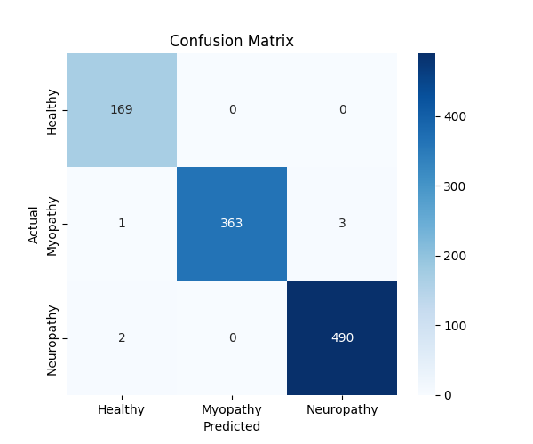
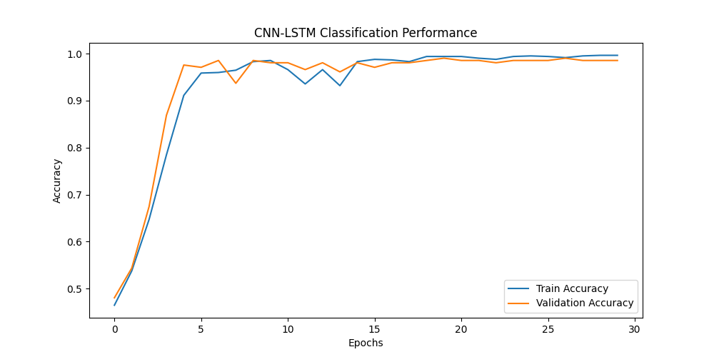

# 🧠 EMG Signal-Based Disease Classification using Deep Learning

[](https://www.python.org/)
[](https://keras.io/)
[](LICENSE)

## 📌 Project Overview

This project focuses on the classification of neuromuscular diseases using EMG (Electromyography) signals through deep learning. EMG signals carry valuable muscle activity data, which are analyzed using a 1D CNN model to detect health conditions such as **Myopathy**, **Neuropathy**, and **Healthy** states.

The system includes:
- Data parsing from `.dat` and `.hea` files
- Signal preprocessing and visualization
- CNN model training, evaluation, and saving
- Performance visualization (training accuracy/loss)
- Prediction on unseen signals

---

## 📁 Project Structure

```

Deep-Learning-EMG-Disease-Classification/
├── Model Architecture/
│   └── Model Arch.JPG                  # Visual representation of CNN model
├── results/
│   ├── accuracy.txt                    # Final accuracy of model
│   ├── confusion\_matrix.png            # Evaluation matrix
│   ├── emg\_model.h5                    # Trained model
│   ├── training\_performance.png        # Accuracy/Loss graph
├── Training.py                         # Training and evaluation code
├── prediction.py                       # EMG prediction on new signals
├── signal\_representation.py           # Visualization and signal handling
├── emg\_healthy.dat / .hea              # EMG signals for healthy class
├── emg\_myopathy.dat / .hea             # EMG signals for myopathy
├── emg\_neuropathy.dat / .hea           # EMG signals for neuropathy
├── README.md                           # Project documentation
└── LICENSE                             # License file

````

---

## 🔍 Dataset Description

The dataset consists of `.dat` and `.hea` files containing EMG signals. Each signal file corresponds to a class:
- `emg_healthy.*` → Healthy muscle activity
- `emg_myopathy.*` → Myopathy condition
- `emg_neuropathy.*` → Neuropathy condition

---

## 🧠 Deep Learning Model

- **Type:** 1D Convolutional Neural Network (Conv1D)
- **Input:** Processed EMG signal arrays
- **Layers:** Conv1D → MaxPooling → Flatten → Dense
- **Activation:** ReLU and Softmax
- **Loss Function:** Categorical Crossentropy
- **Optimizer:** Adam

📷 *Model Architecture:*  


---

## 📈 Model Performance

- 📌 **Accuracy:** Refer to `results/accuracy.txt`
- 🧩 **Confusion Matrix:**  
  

- 📉 **Training Performance:**  
  

---

## ▶️ How to Run

1. Clone the repository:
```bash
git clone https://github.com/udityamerit/Deep-Learning-Project-for-finding-the-Disease-based-on-Emg-Signals.git
cd Deep-Learning-Project-for-finding-the-Disease-based-on-Emg-Signals
````

2. Install dependencies:

```bash
pip install numpy pandas matplotlib tensorflow
```

3. Train the model:

```bash
python Training.py
```

4. Predict disease using trained model:

```bash
python prediction.py
```

---

## ⚙️ Main Files

| File                       | Description                                    |
| -------------------------- | ---------------------------------------------- |
| `Training.py`              | Train and evaluate the CNN model               |
| `prediction.py`            | Predict disease class from a new EMG signal    |
| `signal_representation.py` | Signal preprocessing and visualization scripts |
| `emg_model.h5`             | Saved trained model                            |
| `*.dat / *.hea`            | EMG signal data files (PhysioBank style)       |

---

## 📌 Author

**Uditya Narayan Tiwari**
🎓 B.Tech CSE (AI & ML) @ VIT Bhopal
🌐 [Portfolio](https://udityanarayantiwari.netlify.app/)
🔗 [LinkedIn](https://www.linkedin.com/in/uditya-narayan-tiwari-562332289/)
💻 [GitHub](https://github.com/udityamerit)

---

## 📄 License

This project is licensed under the [MIT License](LICENSE).
